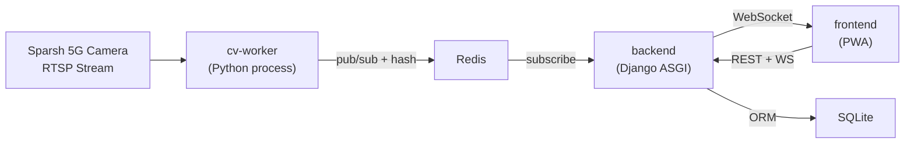
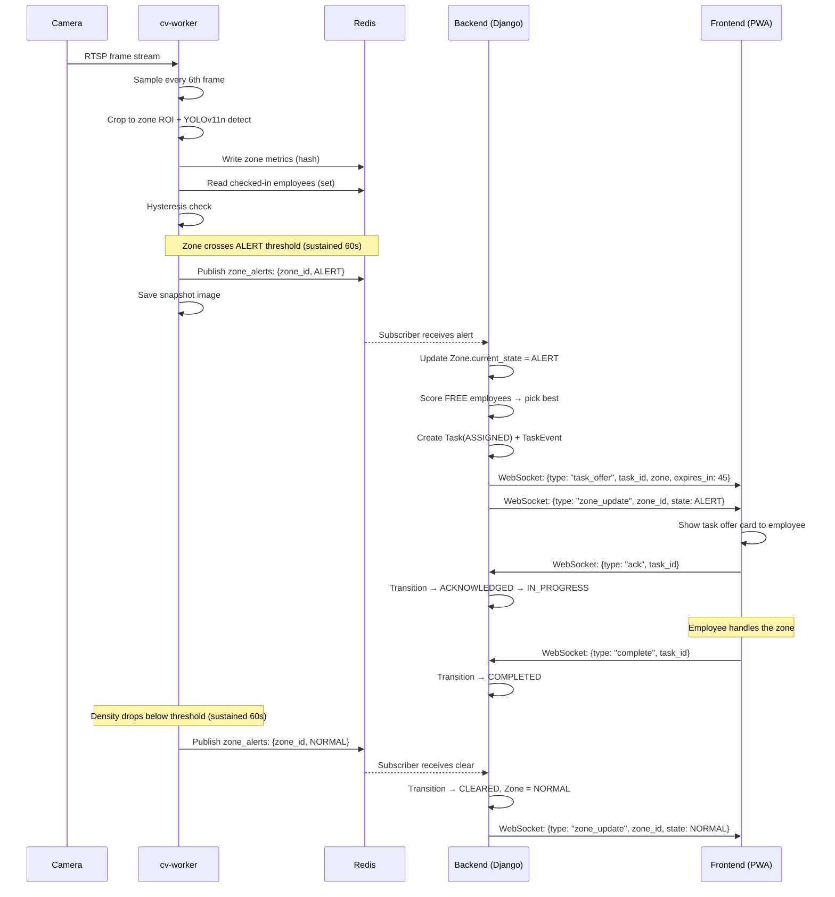

# Smart Employee Reallocation System — Implementation Plan

## Overview

A 5G/MEC retail prototype where cameras monitor retail zones, an MEC-hosted CV pipeline detects crowd density, and the system automatically assigns the best-available employee to overcrowded zones via a closed-loop task state machine. Four separate services communicate through Redis.



---

## Project Directory Structure

```
d:\CODING\Employment management system\
├── README.md
├── .env.example
├── requirements.txt              # All Python deps (backend + cv-worker)
│
├── cv_worker/                    # Service 1: CV Pipeline (plain Python)
│   ├── __init__.py
│   ├── config.py                 # All configurable values (env vars / defaults)
│   ├── main.py                   # Entry point: capture → sample → detect → publish
│   ├── capture.py                # Camera frame capture (RTSP via OpenCV)
│   ├── detector.py               # YOLOv11n ONNX inference + ROI cropping
│   ├── zone_tracker.py           # Per-zone person counting, hysteresis logic
│   ├── redis_publisher.py        # Write zone metrics to Redis hash + pub/sub
│   ├── snapshot.py               # Alert snapshot save + 48h cleanup scheduler
│   └── models/
│       └── yolo11n.onnx          # Pre-exported ONNX model (git-ignored, download script)
│
├── backend/                      # Service 2: Django ASGI application
│   ├── manage.py
│   ├── backend/                  # Django project package
│   │   ├── __init__.py
│   │   ├── settings.py
│   │   ├── urls.py
│   │   ├── asgi.py               # ProtocolTypeRouter: HTTP + WebSocket
│   │   └── wsgi.py
│   │
│   ├── core/                     # Main Django app
│   │   ├── __init__.py
│   │   ├── models.py             # Zone, Employee, Task, TaskEvent
│   │   ├── admin.py
│   │   ├── serializers.py        # DRF serializers
│   │   ├── views.py              # DRF viewsets + custom endpoints
│   │   ├── urls.py               # REST API routing
│   │   ├── consumers.py          # WebSocket consumers (Django Channels)
│   │   ├── routing.py            # WebSocket URL patterns
│   │   ├── assignment.py         # Scoring engine + assignment logic
│   │   ├── state_machine.py      # Task state transitions + auto-reassign
│   │   ├── redis_subscriber.py   # Background task: subscribe to cv-worker channel
│   │   ├── middleware.py         # Token auth middleware for WebSocket
│   │   ├── seed.py               # Management command: seed demo data
│   │   └── tasks.py              # Periodic tasks (acknowledgment timeout checker)
│   │
│   └── static/                   # Service 4: Frontend PWA (served by Django)
│       ├── index.html            # App shell — SPA-like single page
│       ├── manifest.json         # PWA manifest
│       ├── sw.js                 # Service worker (cache + queue + retry)
│       ├── css/
│       │   └── style.css         # All styles
│       ├── js/
│       │   ├── app.js            # Main app logic, routing, state
│       │   ├── ws.js             # WebSocket client + exponential backoff reconnect
│       │   ├── api.js            # REST API helpers + offline queue
│       │   ├── employee.js       # Employee view logic
│       │   └── manager.js        # Manager dashboard view logic
│       └── icons/
│           ├── icon-192.png
│           └── icon-512.png
│
├── snapshots/                    # Alert snapshot images (auto-cleaned after 48h)
│   └── .gitkeep
│
└── scripts/
    ├── download_model.py         # Download yolo11n.onnx from Ultralytics
    ├── run_all.py                # Convenience: start Redis, backend, cv-worker together
    └── simulate_crowd.py         # Demo: simulate camera feed for testing without hardware
```

---

## Service Details

### Service 1: cv-worker (Plain Python)

**Purpose:** Capture camera frames, run YOLOv11n person detection, compute per-zone metrics, publish to Redis.

#### Libraries

| Library | Version | Purpose |
|---------|---------|---------|
| `opencv-python-headless` | ≥4.9 | RTSP capture, frame manipulation, ROI masking |
| `onnxruntime` | ≥1.17 | YOLOv11n inference (CPU); `onnxruntime-gpu` for CUDA/TensorRT |
| `numpy` | ≥1.26 | Array operations |
| `redis` | ≥5.0 | Publish zone metrics, write Redis hashes |
| `ultralytics` | ≥8.3 | One-time model export utility only (not used at runtime) |
| `Pillow` | ≥10.0 | Snapshot image saving |
| `python-dotenv` | ≥1.0 | Load .env configuration |
| `schedule` | ≥1.2 | Snapshot cleanup scheduling |

#### Key Files

##### `config.py`
```python
# All configurable values with env-var overrides
CAMERA_URLS = [...]            # RTSP URLs or file paths for testing
FRAME_SAMPLE_INTERVAL = 6     # Process every Nth frame (configurable)
ONNX_MODEL_PATH = "..."
REDIS_HOST / REDIS_PORT
ZONE_ROIS = {...}              # Dict of zone_id -> polygon vertices
ALERT_THRESHOLD_DENSITY = 0.7
HYSTERESIS_WINDOW_SEC = 60     # Sustained seconds before state change
SNAPSHOT_DIR / SNAPSHOT_TTL_HOURS = 48
```

##### `capture.py`
- Opens RTSP stream(s) via `cv2.VideoCapture`
- Yields every Nth frame (configurable `FRAME_SAMPLE_INTERVAL`)
- Maintains an in-memory ring buffer (`collections.deque(maxlen=...)`) of recent frames for temporal smoothing
- **Never writes raw frames to disk**

##### `detector.py`
- Loads YOLOv11n ONNX model via `onnxruntime.InferenceSession`
- Auto-selects execution provider: `TensorRTExecutionProvider` → `CUDAExecutionProvider` → `CPUExecutionProvider`
- For each zone ROI: crops/masks the frame to the polygon region before inference
- Returns list of person bounding boxes per zone
- Pre/post-processing: resize to 640×640, normalize, NMS (exported into ONNX with `nms=True`)

##### `zone_tracker.py`
- Maintains per-zone state: `person_count`, `checked_in_employees` (read from Redis), `customer_count`, `density`, `state` (NORMAL/ALERT)
- **Hysteresis logic:**
  - Tracks a `sustained_above_counter` and `sustained_below_counter` per zone (in seconds)
  - NORMAL → ALERT: only when customer density stays above threshold for `HYSTERESIS_WINDOW_SEC` consecutive seconds
  - ALERT → NORMAL: only when customer density stays below threshold for `HYSTERESIS_WINDOW_SEC` consecutive seconds
  - Resets the opposite counter on any toggle
- Temporal smoothing: averages person count over the ring buffer window to reduce jitter

##### `redis_publisher.py`
- Writes per-zone metrics to Redis hash: `zone:{zone_id}:metrics`
  ```json
  {"zone_id": "Z1", "total_person_count": 12, "checked_in_employee_ids": "[E1,E3]",
   "customer_count": 10, "density": 0.83, "timestamp": 1720000000}
  ```
- On state change (NORMAL↔ALERT), publishes to Redis channel `zone_alerts`:
  ```json
  {"zone_id": "Z1", "new_state": "ALERT", "density": 0.83, "customer_count": 10, "timestamp": ...}
  ```

##### `snapshot.py`
- On ALERT trigger: saves exactly one JPEG snapshot to `snapshots/{zone_id}_{timestamp}.jpg`
- Runs a cleanup loop (via `schedule` library) every hour, deleting files older than 48 hours

##### `main.py` (entry point)
```
loop:
  frame = capture.next_frame()
  for zone in zones:
      cropped = crop_to_roi(frame, zone.roi)
      detections = detector.detect(cropped)
      zone_tracker.update(zone.id, detections)
      redis_publisher.publish(zone.id, zone_tracker.get_metrics(zone.id))
```

---

### Service 2: backend (Django + DRF + Channels)

**Purpose:** REST API, WebSocket layer, DB models, assignment engine, task state machine.

#### Libraries

| Library | Version | Purpose |
|---------|---------|---------|
| `Django` | ≥5.1 | Web framework |
| `djangorestframework` | ≥3.15 | REST API |
| `channels` | ≥4.1 | WebSocket support (ASGI) |
| `channels-redis` | ≥4.2 | Redis channel layer backend |
| `daphne` | ≥4.1 | ASGI server |
| `redis` | ≥5.0 | Direct Redis access (subscriber) |
| `python-dotenv` | ≥1.0 | Env configuration |
| `djangorestframework-simplejwt` | ≥5.3 | Token-based auth |

#### Data Models (`core/models.py`)

```python
class Zone(models.Model):
    name = models.CharField(max_length=100)
    threshold_density = models.FloatField(default=0.7)
    threshold_customer_count = models.IntegerField(default=8)
    hysteresis_window = models.IntegerField(default=60)  # seconds
    current_state = models.CharField(choices=["NORMAL","ALERT"], default="NORMAL")
    required_skill = models.CharField(max_length=100, blank=True)
    # Zone adjacency stored as JSON: {"Z2": 1, "Z3": 2} = distances
    adjacency_map = models.JSONField(default=dict)
    
class Employee(models.Model):
    name = models.CharField(max_length=100)
    skill_tags = models.JSONField(default=list)  # ["checkout", "electronics", ...]
    status = models.CharField(
        choices=["FREE","ASSIGNED","BUSY","OFFLINE"], default="OFFLINE"
    )
    current_zone = models.ForeignKey(Zone, null=True, on_delete=models.SET_NULL)
    last_assigned_at = models.DateTimeField(null=True)
    auth_token = models.CharField(max_length=64, unique=True)  # Simple token auth

class Task(models.Model):
    zone = models.ForeignKey(Zone, on_delete=models.CASCADE)
    assigned_employee = models.ForeignKey(Employee, null=True, on_delete=models.SET_NULL)
    status = models.CharField(
        choices=["CREATED","ASSIGNED","ACKNOWLEDGED","IN_PROGRESS","COMPLETED","CLEARED"],
        default="CREATED"
    )
    score_at_assignment = models.FloatField(default=0)
    reassignment_count = models.IntegerField(default=0)
    created_at = models.DateTimeField(auto_now_add=True)
    acknowledged_at = models.DateTimeField(null=True)
    completed_at = models.DateTimeField(null=True)

class TaskEvent(models.Model):
    task = models.ForeignKey(Task, on_delete=models.CASCADE, related_name="events")
    event_type = models.CharField(max_length=50)
    # Event types: CREATED, ASSIGNED, ACKNOWLEDGED, IN_PROGRESS, 
    #              COMPLETED, CLEARED, ESCALATED, MANAGER_FLAGGED, REASSIGNED
    timestamp = models.DateTimeField(auto_now_add=True)
    details = models.JSONField(default=dict)
```

#### Assignment Engine (`core/assignment.py`)

```python
def score_employee(employee, alert_zone, zone_metrics):
    """
    score = w1*proximity + w2*zone_load + w3*skill_match
    
    - proximity: 1.0 if same zone, decreases by adjacency distance (normalized 0-1)
    - zone_load: inverse of employee's current zone density (prefer low-load zones)
    - skill_match: 1.0 if skill overlap, else 0.3 baseline
    - Weights: w1=0.5, w2=0.3, w3=0.2 (configurable, must sum to 1)
    """
    
def find_best_employee(alert_zone):
    """
    1. Filter employees where status == FREE
    2. Score each using score_employee()
    3. Tie-break: prefer employee with oldest last_assigned_at
    4. Return top-scored employee (or None if no one is free)
    """
    
def create_and_assign_task(zone, employee, score):
    """
    1. Create Task(zone=zone, assigned_employee=employee, status=ASSIGNED, score=score)
    2. Create TaskEvent(task, event_type=ASSIGNED)
    3. Update employee.status = ASSIGNED, employee.last_assigned_at = now
    4. Send WebSocket task_offer to that employee's channel
    5. Schedule 45s timeout check
    """
```

#### Task State Machine (`core/state_machine.py`)

```
CREATED ──→ ASSIGNED ──→ ACKNOWLEDGED ──→ IN_PROGRESS ──→ COMPLETED ──→ CLEARED
                │                                              │
                ▼ (45s timeout)                                ▼ (density drops)
           REASSIGNED (up to 2x)                          auto-CLEARED
                │
                ▼ (after 2 failures)
         MANAGER_FLAGGED
```

- `transition(task, new_state)` — validates transition is legal, creates `TaskEvent`, updates `Task`
- `check_acknowledgment_timeout()` — runs every 10s, finds tasks in ASSIGNED state older than 45s:
  - If `reassignment_count < 2`: reassign to next-best employee, log `ESCALATED` event
  - If `reassignment_count >= 2`: set status to a manager-flagged state, log `MANAGER_FLAGGED` event

#### Redis Subscriber (`core/redis_subscriber.py`)

- Runs as a background thread/task started in Django's `AppConfig.ready()` or via a management command
- Subscribes to Redis channel `zone_alerts`
- On receiving a zone state change message:
  - Updates `Zone.current_state` in the database
  - If new state is `ALERT`: triggers `find_best_employee()` → `create_and_assign_task()`
  - If new state is `NORMAL`: transitions any active tasks for that zone to `CLEARED`
  - Broadcasts `zone_update` WebSocket message to the `zone_updates` Channels group

#### WebSocket Consumer (`core/consumers.py`)

```python
class EmployeeConsumer(AsyncWebsocketConsumer):
    """
    Connected to: ws/employee/{token}/
    
    On connect:
      - Validate token, find Employee
      - Add to personal channel group: employee_{id}
      - Add to broadcast group: zone_updates
    
    On receive (from client):
      - type: "ack"       → transition task to ACKNOWLEDGED
      - type: "complete"  → transition task to COMPLETED
      - type: "checkin"   → update employee.current_zone, write to Redis
    
    Server sends (to client):
      - type: "task_offer"  → {task_id, zone_name, expires_in: 45}
      - type: "zone_update" → {zone_id, state, density}
    
    On disconnect:
      - Remove from groups
    """
```

#### REST API (`core/views.py` + `core/urls.py`)

| Endpoint | Method | Description |
|----------|--------|-------------|
| `/api/zones/` | GET | List all zones |
| `/api/zones/{id}/` | GET | Zone detail |
| `/api/zones/status/` | GET | Current state of all zones (manager dashboard) |
| `/api/employees/` | GET | List all employees |
| `/api/employees/{id}/` | GET/PATCH | Employee detail, update status |
| `/api/tasks/` | GET | List tasks (filterable by status) |
| `/api/tasks/{id}/` | GET | Task detail with events |
| `/api/tasks/history/` | GET | Completed tasks with timing metrics |
| `/api/auth/token/` | POST | Get JWT token (employee login) |

#### Token Auth (`core/middleware.py`)

- Simple token-based auth for WebSocket: token passed as URL parameter (`ws/employee/{token}/`)
- DRF uses `djangorestframework-simplejwt` for REST API auth
- For the prototype demo, also support a simple static token per employee (from seed data)

#### ASGI Configuration (`backend/asgi.py`)

```python
application = ProtocolTypeRouter({
    "http": django_asgi_app,
    "websocket": TokenAuthMiddleware(
        URLRouter([
            path("ws/employee/<str:token>/", EmployeeConsumer.as_asgi()),
        ])
    ),
})
```

#### Settings (`backend/settings.py`)

```python
INSTALLED_APPS = ["daphne", "channels", "rest_framework", "core", ...]
ASGI_APPLICATION = "backend.asgi.application"
CHANNEL_LAYERS = {
    "default": {
        "BACKEND": "channels_redis.core.RedisChannelLayer",
        "CONFIG": {"hosts": [(REDIS_HOST, REDIS_PORT)]},
    },
}
DATABASES = {"default": {"ENGINE": "django.db.backends.sqlite3", "NAME": BASE_DIR / "db.sqlite3"}}
# Note in README: use Postgres for production
```

#### Seed Script (`core/seed.py` → management command `python manage.py seed`)

Creates:
- 4 Zones: "Entrance", "Electronics", "Checkout", "Grocery" — with adjacency map, thresholds, required skills
- 6 Employees: with names, skill tags, auth tokens, all status=FREE
- Zone adjacency: Entrance↔Electronics (dist=1), Entrance↔Checkout (dist=2), etc.

---

### Service 3: Redis

**Purpose:** Shared in-memory state for live zone metrics + pub/sub + Channels layer backend.

- **No custom code** — just a running Redis server (default port 6379)
- Used for:
  1. **Zone metrics hashes:** `zone:{zone_id}:metrics` — written by cv-worker, read by backend
  2. **Employee check-in set:** `zone:{zone_id}:checked_in` — written by backend (on checkin), read by cv-worker
  3. **Pub/sub channel:** `zone_alerts` — cv-worker publishes state changes, backend subscribes
  4. **Django Channels layer** — WebSocket message routing

---

### Service 4: Frontend PWA

**Purpose:** Lightweight progressive web app served as static files by Django.

#### Technology
- **Vanilla JavaScript** — no framework, no build step
- **Service Worker** for offline caching + action queuing
- **CSS** with CSS custom properties for theming

#### Views

##### Employee View (`/` — default, identified by token in URL hash)
- Current status badge (FREE / ASSIGNED / BUSY)
- Current zone display + "Check in to Zone X" selector
- **Task offer card** — appears when a `task_offer` WebSocket message arrives:
  - Zone name, countdown timer (45s), ACK button, decline (optional)
- **Active task panel** — after ACK:
  - "Mark Complete" button
  - Task timer (time since acknowledgment)
- Connection status indicator (🟢 connected / 🟡 reconnecting / 🔴 offline)

##### Manager Dashboard View (`/#manager`)
- Zone cards grid: each zone shows name, current state (color-coded), density bar, person count
- Active tasks list: employee name, zone, status, time elapsed
- Simple metrics: avg response time, tasks completed today

#### PWA / Offline Support

##### `manifest.json`
```json
{
  "name": "Smart Reallocation System",
  "short_name": "SRS",
  "start_url": "/",
  "display": "standalone",
  "theme_color": "#1a1a2e",
  "background_color": "#16213e",
  "icons": [...]
}
```

##### `sw.js` (Service Worker)
1. **Cache-first for app shell:** On install, pre-cache `index.html`, `style.css`, all JS files, icons
2. **Network-first for API calls:** Try network, fall back to cached response for GET requests
3. **Offline action queue:** When a POST/PATCH fails (ack, complete, checkin):
   - Store in IndexedDB queue with timestamp
   - On reconnect, replay queued actions in order with exponential backoff
   - Show "queued" indicator in UI

##### `ws.js` (WebSocket Client)
```javascript
class ReconnectingWebSocket {
    constructor(url) {
        this.url = url;
        this.backoff = { initial: 1000, max: 30000, multiplier: 2 };
        this.attempt = 0;
    }
    
    connect() {
        this.ws = new WebSocket(this.url);
        this.ws.onopen = () => { this.attempt = 0; /* ... */ };
        this.ws.onclose = () => { this.scheduleReconnect(); };
        this.ws.onmessage = (e) => { this.handleMessage(JSON.parse(e.data)); };
    }
    
    scheduleReconnect() {
        const delay = Math.min(
            this.backoff.initial * Math.pow(this.backoff.multiplier, this.attempt),
            this.backoff.max
        );
        this.attempt++;
        setTimeout(() => this.connect(), delay);
    }
}
```

##### `api.js` (REST Client with Retry)
- Wraps `fetch()` with offline detection
- On failure: stores action in IndexedDB, shows "queued" badge
- On reconnect: drains queue, retries with backoff

---

## Inter-Service Communication Flow



---

## Environment Variables (`.env.example`)

```env
# Redis
REDIS_HOST=127.0.0.1
REDIS_PORT=6379

# CV Worker
CAMERA_URLS=rtsp://192.168.1.100:554/stream1
FRAME_SAMPLE_INTERVAL=6
ONNX_MODEL_PATH=cv_worker/models/yolo11n.onnx
SNAPSHOT_DIR=snapshots
SNAPSHOT_TTL_HOURS=48

# Django
DJANGO_SECRET_KEY=change-me-in-production
DEBUG=True
ALLOWED_HOSTS=*

# Assignment weights (must sum to 1)
WEIGHT_PROXIMITY=0.5
WEIGHT_ZONE_LOAD=0.3
WEIGHT_SKILL_MATCH=0.2

# Task timeouts
ACK_TIMEOUT_SECONDS=45
MAX_REASSIGNMENTS=2
HYSTERESIS_WINDOW_SECONDS=60
```

---

## Startup Sequence

1. **Start Redis:** `redis-server` (or `redis-server.exe` on Windows, or Docker: `docker run -p 6379:6379 redis`)
2. **Seed Database:** `cd backend && python manage.py migrate && python manage.py seed`
3. **Start Backend:** `cd backend && daphne -b 0.0.0.0 -p 8000 backend.asgi:application`
4. **Start CV Worker:** `cd .. && python -m cv_worker.main` (or `python scripts/simulate_crowd.py` for demo without cameras)
5. **Open Frontend:** Navigate to `http://localhost:8000/static/index.html`

> [!NOTE]
> `scripts/run_all.py` will automate steps 1-4 with proper process management for demo convenience.

---

## Simulation Script (`scripts/simulate_crowd.py`)

For demos without physical cameras:
- Generates synthetic zone metric data (gradually increasing/decreasing person counts)
- Publishes directly to the same Redis channels as the real cv-worker
- Supports scenarios: "zone goes to alert", "zone clears", "multiple zones alert simultaneously"
- Controlled via command-line args: `--zone Z1 --ramp-to 15 --duration 120`

---

## Verification Plan

### Automated Tests
1. **Unit tests** for assignment engine scoring (various employee/zone combinations)
2. **Unit tests** for state machine transitions (valid transitions, timeout logic, reassignment cap)
3. **Unit tests** for hysteresis logic (sustained window counting)

### End-to-End Browser Verification
After frontend is functional, use the built-in browser to verify the full loop:
1. Start all services (backend + simulate_crowd.py)
2. Open manager view → confirm zones show as NORMAL
3. Run simulation to push Zone "Electronics" above threshold for 60s
4. Confirm zone card turns ALERT (red) on manager dashboard
5. Open employee view → confirm task offer appears with 45s countdown
6. Tap ACK → confirm task status transitions to ACKNOWLEDGED/IN_PROGRESS
7. Tap Complete → confirm task transitions to COMPLETED
8. Wait for simulated density to drop → confirm zone returns to NORMAL and task CLEARED
9. Check `/api/tasks/history/` for timing metrics

### Manual Verification
- Test offline mode: disconnect network, tap ACK → confirm "queued" indicator → reconnect → confirm action replays
- Test auto-reassign: let 45s timeout expire without ACKing → confirm task reassigns to next employee
- Test manager flagging: let 3 consecutive timeouts (original + 2 reassignments) → confirm manager flag

---

## Open Questions

> [!IMPORTANT]
> **Camera feed for development:** Since we likely don't have the Sparsh 5G cameras available during development, I'll build the `simulate_crowd.py` script as the primary way to demo the system. The real camera integration via RTSP will be wired up but tested only when hardware is available. Is this acceptable?

> [!IMPORTANT]
> **Redis installation on Windows:** Redis doesn't have official Windows support. Options are:
> 1. Use Docker: `docker run -p 6379:6379 redis` (recommended)
> 2. Use Memurai (Windows-native Redis alternative)
> 3. Use WSL2
> 
> Which approach do you prefer, or should I document all three?

> [!NOTE]
> **Model download:** YOLOv11n ONNX model (~12MB) will not be committed to the repo. The `scripts/download_model.py` script will fetch it. Should I also include a fallback to download it automatically on first run of cv-worker?

> [!NOTE]
> **Frontend design:** The spec says "lightweight" — I'll keep it clean and functional with a dark theme suitable for retail floor use (high contrast, large touch targets). Any specific branding colors or preferences?
